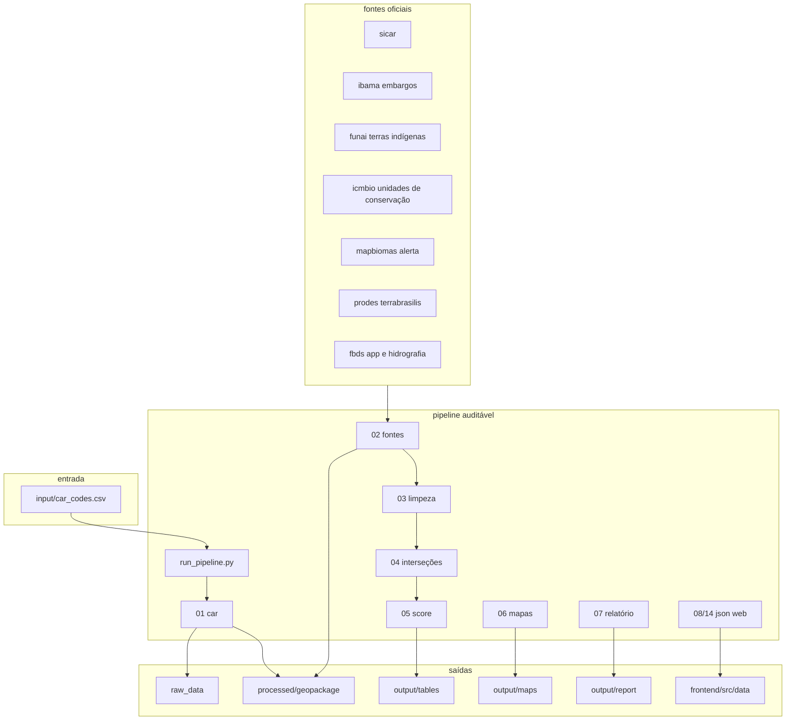

# triagem socioambiental de imóveis rurais, case sicredi

solução técnica para triagem socioambiental e climática em crédito rural. o projeto cruza quatro imóveis rurais do case com bases oficiais, calcula sobreposições, organiza evidências auditáveis, gera relatório técnico, anexo cartográfico e um webgis para análise visual.

o objetivo não é automatizar decisão de crédito. a matriz serve para priorizar análise, diligência e monitoramento, dentro de uma leitura aderente a sac/prsac.

## sumário

- [o que o projeto entrega](#o-que-o-projeto-entrega)
- [contexto regulatório](#contexto-regulatório)
- [arquitetura](#arquitetura)
- [estrutura do repositório](#estrutura-do-repositório)
- [por que há scripts numerados](#por-que-há-scripts-numerados)
- [fluxo de dados](#fluxo-de-dados)
- [imóveis analisados](#imóveis-analisados)
- [metodologia](#metodologia)
- [saídas geradas](#saídas-geradas)
- [frontend](#frontend)
- [api opcional](#api-opcional)
- [banco corporativo](#banco-corporativo)
- [instalação e execução](#instalação-e-execução)
- [documentação complementar](#documentação-complementar)
- [limitações](#limitações)

## o que o projeto entrega

o case parte de quatro códigos car e exige uma análise espacial com bases socioambientais. este repositório entrega:

- pipeline geoespacial em python;
- registro de fontes e evidências;
- matriz de triagem com restrição socioambiental, risco climático e pressão no entorno;
- relatório técnico em pdf;
- anexo cartográfico em pdf, com uma página por imóvel;
- webgis em react para consulta e apresentação.

o script `01_download_car.py` é bloqueante. sem polígono oficial do car, o cruzamento não roda. não há uso de geometria fictícia.

## contexto regulatório

| tema | leitura usada no case |
|------|------------------------|
| car/sicar | unidade ambiental declaratória do imóvel rural, sem tratar o cadastro como prova de domínio |
| prsac | referência para responsabilidade social, ambiental e climática no gerenciamento de riscos |
| mcr 2-9 | referência para impedimentos sociais, ambientais e climáticos em crédito rural |
| matriz de triagem | indicador interno da solução, sem caráter de rating regulatório ou decisão automática |

## arquitetura



## estrutura do repositório

```text
sicredi_case/
├── input/
│   └── car_codes.csv
├── scripts/
│   ├── run_pipeline.py
│   ├── 00_setup_project.py
│   ├── 01_download_car.py
│   ├── 02_download_reference_layers.py
│   ├── 02b_download_fbds_app.py
│   ├── 02c_download_climate_layers.py
│   ├── 02d_download_fbds_hydro.py
│   ├── 02e_download_mapbiomas_fire.py
│   ├── 03_clean_layers.py
│   ├── 04_intersections.py
│   ├── 05_risk_scoring.py
│   ├── 06_generate_maps.py
│   ├── 07_generate_report.py
│   ├── 08_export_web_data.py
│   ├── 09_download_advanced_layers.py
│   ├── 10_distance_and_context_metrics.py
│   ├── 11_climate_credit_risk.py
│   ├── 12_territorial_pressure_index.py
│   ├── 13_integrated_credit_risk.py
│   ├── 14_export_advanced_web_data.py
│   ├── score_config.py
│   ├── utils_geo.py
│   ├── utils_sources.py
│   ├── utils_audit.py
│   └── utils_advanced.py
├── raw_data/
│   ├── car/
│   ├── fbds/
│   ├── ibama_embargos/
│   ├── mapbiomas_alerta/
│   ├── climate/
│   └── advanced/mapbiomas_fire/
├── processed/
│   ├── geopackage/
│   └── geojson/
├── output/
│   ├── tables/
│   ├── maps/
│   ├── report/
│   └── web_exports/
├── frontend/
├── backend/
├── database/
└── docs/
```

## por que há scripts numerados

os scripts numerados não são uma lista para o avaliador rodar manualmente. eles foram mantidos como etapas auditáveis, porque em uma rotina de risco é importante conseguir:

- reprocessar só a etapa afetada quando uma base muda;
- verificar insumos e intermediários locais em `raw_data/` e `processed/`, além das saídas versionadas em `output/`;
- separar download, geoprocessamento, score e apresentação;
- versionar fontes, evidências e regras;
- migrar a execução local para scheduler ou postgis sem perder rastreabilidade.

para uso normal do case, o comando de entrada é único:

```bash
python scripts/run_pipeline.py --profile full
```

perfis disponíveis:

| perfil | uso |
|--------|-----|
| `full` | roda o fluxo completo |
| `base` | roda a triagem socioambiental base |
| `advanced` | recalcula camadas complementares e publica novamente |
| `publish` | regenera mapas, jsons e pdf a partir dos dados processados |

## fluxo de dados

as etapas abaixo documentam a lógica interna do pipeline. para execução completa, use `scripts/run_pipeline.py`.

| etapa | função | saída principal |
|-------|--------|-----------------|
| `00_setup_project.py` | cria e valida a estrutura de pastas | diretórios do projeto |
| `01_download_car.py` | obtém os quatro polígonos oficiais do car | `cars_analisados.gpkg` |
| `02_download_reference_layers.py` | baixa bases ibama, funai, icmbio, mapbiomas e prodes | camadas em `processed/geopackage/` |
| `02b_download_fbds_app.py` | baixa app fbds por município | `fbds_app.gpkg` |
| `02c_download_climate_layers.py` | baixa indicador climático municipal | `climate_indices_by_car.csv` |
| `02d_download_fbds_hydro.py` | baixa massas d'água e rios fbds | `fbds_hidrografia.gpkg` |
| `02e_download_mapbiomas_fire.py` | baixa cicatrizes de queimada | `mapbiomas_fire_scars.gpkg` |
| `03_clean_layers.py` | corrige geometria, crs e campos | camadas limpas |
| `04_intersections.py` | cruza car com as camadas e dissolve por tema | `intersections_wide.csv` |
| `05_risk_scoring.py` | calcula restrição socioambiental atual | `risk_summary.csv` |
| `06_generate_maps.py` | gera o anexo cartográfico | `anexo_mapas_socioambientais.pdf` |
| `07_generate_report.py` | gera o relatório técnico | `relatorio_tecnico_sicredi.pdf` |
| `08_export_web_data.py` | exporta dados base para o frontend | jsons em `frontend/src/data/` |
| `09` a `13` | calcula clima, entorno e classificação consolidada | tabelas complementares |
| `14_export_advanced_web_data.py` | exporta dados complementares para o frontend | jsons complementares |

## imóveis analisados

| id | uf | código car | resultado resumido |
|----|----|------------|--------------------|
| `CAR_01` | rs | `RS-4319406-47EE57...` | baixo, sem sobreposições relevantes |
| `CAR_02` | pr | `PR-4109401-014658...` | médio, com unidade de conservação e desmatamento |
| `CAR_03` | mt | `MT-5103254-B043C...` | baixo em restrição atual, com app fbds e atenção climática |
| `CAR_04` | mt | `MT-5101407-324C35...` | alto, com embargo, unidade de conservação e desmatamento |

## metodologia

### sistemas de coordenadas

| uso | crs |
|-----|-----|
| mapa, webgis e geojson | `epsg:4326` |
| área e interseção | `epsg:5880` |

área não é calculada em graus decimais.

### dimensões da matriz

| dimensão | função |
|----------|--------|
| restrição socioambiental atual | mede sobreposições dentro do imóvel |
| risco climático | mede exposição prospectiva ligada a produtividade e capacidade de pagamento |
| pressão no entorno | mede sinais territoriais em buffers |
| classificação consolidada | combina as três dimensões para priorização |

as siglas internas (`irsa`, `icrc`, `ipt` e `irtc`) aparecem em arquivos e colunas por estabilidade técnica. na apresentação, a nomenclatura usada é a de negócio.

### restrição socioambiental atual

| critério | peso máximo | fórmula |
|----------|-------------|---------|
| embargo ibama | 35 | `min(35, embargo_pct * 3.5)` |
| terra indígena | 25 | `min(25, ti_pct * 2.5)` |
| unidade de conservação | 15 | `min(15, uc_pct * 1.5)` |
| app fbds | 15 | `min(15, app_pct * 1.5)` |
| desmatamento | 10 | `min(10, desmatamento_pct * 1.0)` |

classes:

| classe | regra |
|--------|-------|
| baixo | score até 20, sem embargo ou terra indígena |
| médio | score acima de 20 e até 50 |
| alto | score acima de 50 ou embargo ativo |

## saídas geradas

### tabelas

| arquivo | conteúdo |
|---------|----------|
| `risk_summary.csv` | restrição socioambiental atual e recomendação |
| `intersections_wide.csv` | hectares e percentual por tema |
| `intersections_long.csv` | detalhe feição a feição |
| `evidence_audit_log.csv` | trilha de evidência |
| `recommendations.csv` | recomendação técnica |
| `resultados_completos.xlsx` | planilha consolidada |
| `climate_credit_risk.csv` | risco climático |
| `territorial_pressure_index.csv` | pressão no entorno |
| `integrated_credit_risk.csv` | classificação consolidada |
| `distance_context_metrics.csv` | distâncias e buffers |
| `advanced_layers_registry.json` | status das camadas complementares |

### geoespacial

| arquivo | conteúdo |
|---------|----------|
| `cars_analisados.gpkg` | quatro polígonos car oficiais |
| `embargos_ibama.gpkg` | embargos recortados |
| `terras_indigenas.gpkg` | terras indígenas recortadas |
| `unidades_conservacao.gpkg` | unidades de conservação recortadas |
| `desmatamento.gpkg` | alertas mapbiomas e prodes |
| `fbds_app.gpkg` | app fbds |
| `fbds_hidrografia.gpkg` | rios e massas d'água fbds |
| `intersections.gpkg` | sobreposições dissolvidas por tema |
| `context_buffers.gpkg` | buffers por imóvel |

### relatório e mapas

| arquivo | conteúdo |
|---------|----------|
| `output/report/relatorio_tecnico_sicredi.pdf` | relatório técnico |
| `output/maps/anexo_mapas_socioambientais.pdf` | anexo cartográfico, uma página por imóvel |

os pdfs finais ficam em `output/report/` e `output/maps/`. o anexo cartográfico foi comprimido para ficar leve o bastante para versionamento. dados brutos (`raw_data/`) e camadas processadas pesadas (`processed/`) continuam fora do git, pois são insumos e intermediários regeneráveis pelo pipeline.

## frontend

o frontend fica em `frontend/` e usa react, typescript e leaflet. ele consome jsons estáticos gerados pelo pipeline.

abas principais:

| aba | conteúdo |
|-----|----------|
| resumo executivo | classificação consolidada, recomendação e leitura do imóvel |
| risco socioambiental | score de restrição e composição por tema |
| risco climático | seca, água, hidrografia, sensibilidade produtiva e fogo |
| parecer técnico | texto de análise por imóvel |
| metodologia | regras, fontes e limitações |
| relatório | indicação dos pdfs finais em `output/report/` e `output/maps/` |

o mapa usa base satélite e camadas de car, embargos, unidades de conservação, terras indígenas, desmatamento, app e hidrografia.

## api opcional

```bash
cd backend
pip install -r requirements.txt
uvicorn app.main:app --reload
```

rotas principais:

| método | rota | retorno |
|--------|------|---------|
| `get` | `/properties` | lista dos imóveis |
| `get` | `/properties/{id}` | detalhe de um imóvel |
| `get` | `/properties/{id}/evidence` | evidências do imóvel |
| `get` | `/properties/{id}/risk` | score e classificação |
| `get` | `/layers/{name}` | geojson da camada |
| `get` | `/summary` | resumo geral |

## banco corporativo

o diretório `database/` documenta a migração para postgis:

- `schema.sql`;
- `views.sql`;
- `load_data.sql`.

na execução local, os dados ficam em gpkg, csv e json. o schema indica como levar a solução para uma rotina com banco espacial, versionamento de bases e histórico de processamento.

## instalação e execução

### ambiente python

```bash
cd sicredi_case
python -m venv .venv

# windows
.venv\Scripts\activate

# linux/mac
source .venv/bin/activate

pip install -r requirements.txt
```

para download automático do sicar no windows, instale o tesseract ocr.

### pipeline

```bash
# fluxo completo
python scripts/run_pipeline.py --profile full

# só publicação, quando os dados processados já existem
python scripts/run_pipeline.py --profile publish

# dados climáticos ou complementares atualizados manualmente
python scripts/run_pipeline.py --profile advanced
```

se o download automático do sicar falhar, use `docs/guia_download_car.md` e coloque os arquivos em `raw_data/car/manual/CAR_XX/`.

### webgis

```bash
cd frontend
npm install
npm run dev
```

acesse `http://localhost:5173`.

build de produção:

```bash
npm run build
```

## documentação complementar

| arquivo | conteúdo |
|---------|----------|
| `docs/metodologia.md` | regras da matriz, crs e leitura atual/prospectiva |
| `docs/matriz_triagem.md` | dimensões de restrição, clima, entorno e consolidado |
| `docs/fontes.md` | fontes e métodos de obtenção |
| `docs/arquitetura.md` | arquitetura técnica |
| `docs/guia_download_car.md` | download manual do car |
| `docs/ingestao_manual_clima.md` | ingestão manual de dados climáticos |
| `docs/limitações.md` | limitações conhecidas |
| `docs/uso_ia.md` | declaração de uso de ia |

## limitações

1. o car é declaratório e não confirma domínio fundiário.
2. serviços externos podem oscilar, principalmente sicar e wfs.
3. bases de desmatamento por wfs podem vir limitadas pela quantidade de feições retornadas.
4. clima é variável prospectiva e deve ser complementado em produção com bases corporativas, ana/cemaden e aqueduct quando disponíveis.
5. a matriz não substitui validação humana nem decisão formal de crédito.
6. o frontend é estático e só atualiza depois de nova exportação do pipeline.

## fechamento

o projeto entrega um fluxo completo de triagem: car oficial, bases públicas, cruzamento espacial, score explicável, evidências, relatório, mapas e webgis. a estrutura local já aponta um caminho de escala com postgis, histórico de processamento e governança de fontes.
